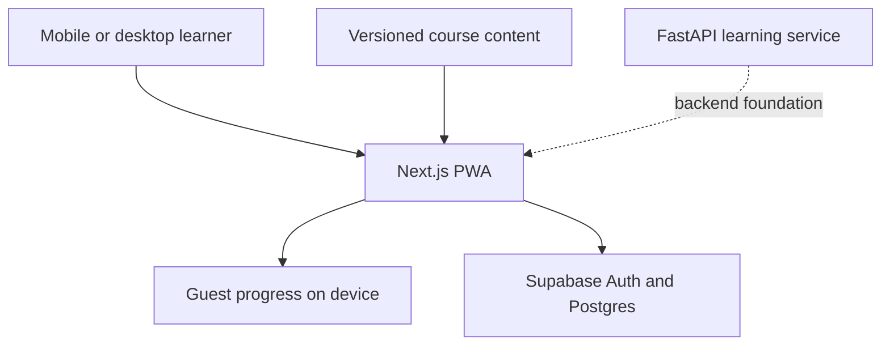

# ByteScroll

<p align="center">
  <strong>Trade scrolling for skill.</strong><br />
  A mobile-first learning feed for Python, data structures and algorithms, and system design.
</p>

<p align="center">
  <a href="https://bytescroll.vercel.app"><strong>Open the live app →</strong></a>
</p>

<p align="center">
  <a href="https://github.com/adityaamitra/ByteScroll/actions/workflows/ci.yml"></a>
  
  
  
  
  <a href="LICENSE"></a>
</p>

## The idea

Short-form feeds are effortless to open and difficult to leave. Traditional learning products often create the opposite experience: choosing a course, finding your place, and committing to a long lesson.

ByteScroll keeps the low-friction interaction while changing the outcome. A learner opens the app and immediately moves through a curated sequence:

**Learn → See an example → Answer → Understand → Review**

Every session pauses at an explicit checkpoint. The learner can stop, review mistakes, or deliberately continue—there is no automatic infinite feed.

## Product highlights

| Area | What ByteScroll provides |
| --- | --- |
| Learning | 18 modules and 164 curated cards across two independent tracks |
| Session design | 5, 10, or 20-card starting checkpoints with optional `Continue +5` |
| Retention | Due-card scheduling, expanding review intervals, and immediate mistake review |
| Feedback | Hints, answer explanations, misconception feedback, and confidence checks |
| Progress | XP, accuracy, streaks, activity history, mastery, bookmarks, and resumable sessions |
| Accounts | Guest mode plus passwordless email login and cross-device progress sync |
| Mobile | Responsive interface, bottom navigation, safe-area support, and installable PWA |
| Cost | Fully useful without a generative-AI API or paid model dependency |

## Curriculum

Both tracks teach concepts before testing them. Modules unlock progressively while each track preserves its own session, mastery, and review state.

| Python and algorithms | System design |
| --- | --- |
| Python foundations | System design foundations |
| Loops and functions | Web and networking |
| Python collections | Data and storage |
| Practical Python and OOP | Scaling and delivery |
| Complexity, arrays, and hashing | Asynchronous systems |
| Linear structures and recursion | Distributed systems |
| Trees, heaps, and graphs | Reliability and operations |
| Search, sorting, and greedy thinking | Security and abuse control |
| Backtracking and dynamic programming | Design case studies |

## How sessions adapt

1. Due review cards are placed first.
2. Unseen cards continue from the learner's selected module.
3. Concepts below the mastery threshold receive extra practice.
4. A wrong answer returns sooner; successful recall increases its review interval.
5. At the checkpoint, the learner chooses whether to finish or add five more cards.

Progress is stored locally for guests. After passwordless sign-in, the same versioned progress document is synchronized to Supabase and protected with row-level security.

## Architecture



The deployed web experience reads curated course content directly, so learning remains available without the FastAPI service. The API is included as a production-oriented boundary for trusted grading, server-generated sessions, and progress aggregation.

## Technology

| Layer | Technology |
| --- | --- |
| Web application | Next.js 15, React 19, TypeScript, CSS |
| Authentication and sync | Supabase Auth, PostgreSQL, row-level security |
| Learning API | FastAPI, Pydantic, SQLAlchemy |
| Content engine | Typed course modules and version-controlled JSON |
| Offline experience | Web app manifest and service worker |
| Quality | TypeScript checks, Pytest, GitHub Actions |
| Deployment | Vercel |

## Repository structure

```text
ByteScroll/
├── apps/
│   ├── web/                         # Next.js learning PWA
│   └── api/                         # FastAPI service and tests
├── content/
│   ├── course-catalog.json          # Public track and module catalog
│   ├── python/                      # Python foundation content
│   └── system-design/               # System Design foundation content
├── supabase/migrations/             # Progress table and RLS policies
├── docs/                            # Product, architecture, and roadmap notes
└── .github/workflows/               # Web and API continuous integration
```

## Run locally

Requirements: Node.js 20 or newer.

```bash
git clone https://github.com/adityaamitra/ByteScroll.git
cd ByteScroll
npm install
npm run dev
```

Open [http://localhost:3000](http://localhost:3000). ByteScroll starts in guest mode and saves progress on the device, so Supabase is not required for local learning.

### Enable account sync

1. Create a Supabase project.
2. Run [`supabase/migrations/001_learner_progress.sql`](supabase/migrations/001_learner_progress.sql) in the Supabase SQL editor.
3. Keep passwordless email authentication enabled.
4. Add your local and production URLs under Supabase Auth URL Configuration.
5. Copy the environment template:

```bash
cp apps/web/.env.example apps/web/.env.local
```

6. Add the browser-safe project values:

```text
NEXT_PUBLIC_SUPABASE_URL=https://your-project.supabase.co
NEXT_PUBLIC_SUPABASE_PUBLISHABLE_KEY=sb_publishable_your-key
```

Never expose a Supabase secret or service-role key. The included row-level security policies restrict each progress record to its authenticated owner. The legacy `NEXT_PUBLIC_SUPABASE_ANON_KEY` variable remains supported for older deployments.

## Run the API

Requirements: Python 3.11 or newer.

```bash
cd apps/api
python3 -m venv .venv
source .venv/bin/activate
pip install -r requirements-dev.txt
uvicorn app.main:app --reload
```

Open [http://localhost:8000/docs](http://localhost:8000/docs) for interactive API documentation, or run the tests with:

```bash
pytest
```

### API surface

| Method | Route | Purpose |
| --- | --- | --- |
| `GET` | `/health` | Service health check |
| `GET` | `/api/v1/catalog` | List tracks and course modules |
| `GET` | `/api/v1/sessions/daily?track_id=python` | Return an answer-safe starter session |
| `POST` | `/api/v1/attempts` | Grade and persist an answer |
| `GET` | `/api/v1/progress/{learner_id}` | Aggregate XP, accuracy, and mastery |

## Product principles

- **Teach before testing.** Beginners should not be examined on ideas the product has not explained.
- **Earn attention; do not trap it.** Checkpoints are explicit and continuing is always a choice.
- **Measure retention, not taps.** Delayed recall matters more than raw time in the app.
- **Keep content reviewable.** Canonical explanations and answers remain curated and version-controlled.
- **Stay useful without AI costs.** Generative tutoring is optional, never a requirement for the core experience.

## Project status

ByteScroll v1 is complete and deployed.

- [x] Complete Python/DSA and advanced System Design paths
- [x] Adaptive sessions and spaced review
- [x] Mobile-responsive installable PWA
- [x] Passwordless accounts and cross-device sync
- [x] Continuous integration and Vercel deployment
- [ ] Sandboxed Python coding exercises
- [ ] Weekly guided mini-projects
- [ ] Interactive system-design workspace

See [`docs/ROADMAP.md`](docs/ROADMAP.md) for the longer-term product direction.

## License

Released under the [MIT License](LICENSE). Copyright © 2026 Aditya Mitra.
