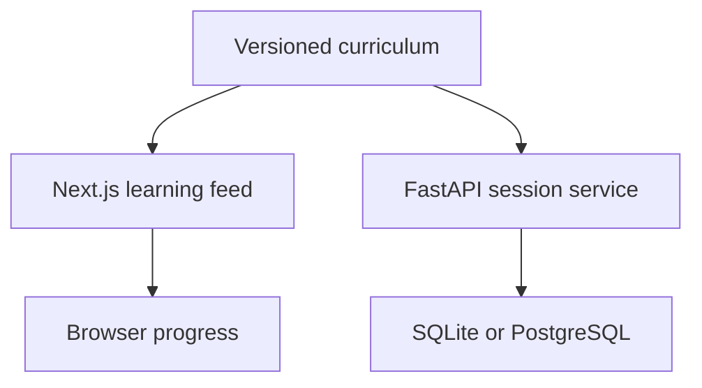
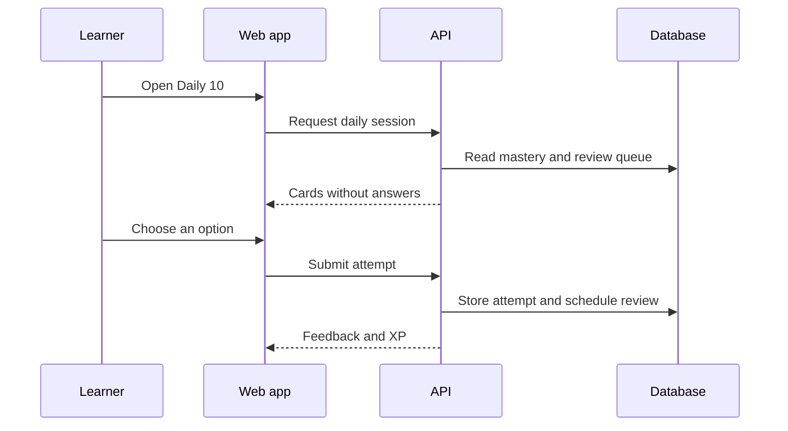

# Architecture

## Current shape

The frontend is a zero-config vertical slice and records prototype progress in `localStorage`. The API independently demonstrates the intended server-side boundary: sessions omit answers, attempts are graded on the server, and progress is derived from stored events.

## Intended authenticated flow

## Domain model

The current persistence layer stores attempts as immutable learning events. This makes aggregate progress reproducible and leaves room for changing the mastery algorithm later.

An attempt contains:

- learner identity;
- card and concept identity;
- selected option;
- correctness and XP awarded; and
- timestamp.

Future tables should include learners, sessions, review scheduling, curriculum versions, and experiment assignments.

## Content boundary

`content/python/foundations.json` is the canonical source in the prototype. Both applications consume it. Public session responses deliberately remove `correct_option_id` and `explanation`.

Before the curriculum grows, add:

- JSON Schema validation;
- duplicate-ID detection;
- executable verification for output-prediction cards;
- reading-level and accessibility checks; and
- reviewer ownership and curriculum versioning.

## Security notes

The project does not execute learner-supplied Python. Adding execution requires isolation, strict resource and network limits, ephemeral filesystems, and abuse controls. Never pass user code to `exec`, `eval`, `subprocess`, or the application host directly.

Authentication should replace free-form learner IDs before any multi-user deployment. CORS origins must also move from local defaults to environment configuration.

## Scaling path

1. Keep lesson content cached and serve session cards through the API.
2. Store attempts as append-only events in PostgreSQL.
3. Precompute a small review queue per learner instead of ranking the full curriculum on every request.
4. Add a worker for review scheduling and analytics events.
5. Introduce Redis only after session or ranking latency demonstrates a need.
