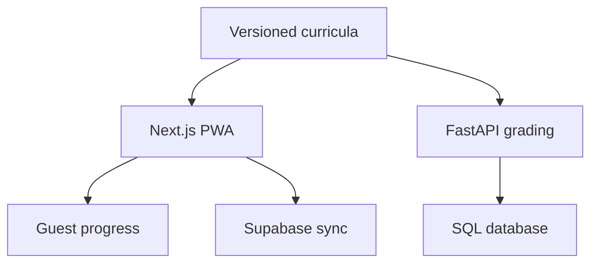

# Architecture

## Product flow

The deployed PWA works without an account. Guest progress is stored on the device. When Supabase is configured and a learner signs in, the same progress document is synchronized to a row protected by PostgreSQL row-level security.

The FastAPI service is the intended long-term boundary for curriculum selection and trusted grading. The static client currently remains independently deployable while that service is hosted.

## Learning state

Progress is versioned and divided into shared and track-specific state.

Shared state includes:

- overall streak;
- learning-day history;
- active tab and track; and
- onboarding preferences.

Each track owns:

- selected module and resumable study session;
- completed cards;
- XP, answers, and accuracy;
- concept-level attempts and confidence;
- bookmarks; and
- a spaced-review queue with due dates and expanding intervals.

## Authentication and sync

The client uses Supabase Auth only when public project configuration is present. Google OAuth and email magic links are supported. ByteScroll never handles or stores passwords.

The `learner_progress` table uses the authenticated user ID as its primary key. Select, insert, and update policies require `auth.uid() = user_id`. No service-role credential is sent to the browser.

On first sign-in:

1. ByteScroll reads the user’s cloud progress.
2. If a record exists, it replaces device state.
3. Otherwise, current guest progress becomes the initial cloud record.
4. Later changes are debounced and upserted.

Conflict-aware merging is a future improvement for learners who modify two devices while both are offline.

## Content model

Each track contains ordered modules. Modules contain teach → example → quiz units, and sessions select from due reviews followed by unseen cards. A step is one of:

- `learn`: concise instruction;
- `example`: a worked example;
- `quiz`: active recall with targeted feedback; or
- `review`: a question that combines recent concepts.

Quiz answers, explanations, wrong-option feedback, and hints are all version-controlled. No runtime AI generation is required.

The client creates a 5, 10, or 20-card starting session, persists its cursor, and pauses at the checkpoint. A learner can finish, review mistakes, or append five more cards repeatedly. Module selection is unlocked after 80% of the previous module is complete.

## PWA behavior

The web manifest provides standalone display metadata and maskable icons. A small network-first service worker caches the application shell and previously loaded same-origin assets. The responsive interface reserves safe-area space for phone navigation and prevents page-level horizontal overflow while allowing code blocks to scroll internally.

## Security boundaries

- Learner-supplied Python is not executed.
- Authenticated cloud records are protected with row-level security.
- Only public Supabase configuration is exposed to the web client.
- Server-side grading responses omit answers from session payloads.
- Future code execution must use an isolated, resource-limited service—not the application host.
